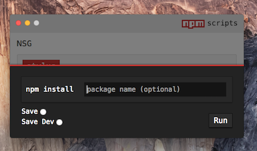

<br>  
<br>  
<p align="center">
 	
</p>
<br>  
<br>  

# npm scripts gui (NSG)
A ~~GUI~~ gooey interface for npm scripts.

[](https://badge.fury.io/gh/samueleaton%2Fnpm-scripts-gui) [](https://badge.fury.io/js/npm-scripts-gui) 

<br>
<p align="center">
 	
</p>
<br>

*Tested on OS X Yosemite and El Capitan*

## Install
Install globally  
```
npm i -g npm-scripts-gui
```

## Instructions
##### Launching  
To launch Npm Script GUI (NSG), you must be in a directory with a ` package.json ` file.   

Then simply run:  
` npm-script-gui ` or the shorter ` nsg `
  
Any text output associated with any npm script in the ` package.json ` will be printed to the command line where NSG was launched. 

##### Quiting  
To **quit** the app, it is safer to close the actual renderer window rather than quiting the process from the command line. If quiting from the command line, NSG may not do the check to make sure all processes are killed before closing. 

##### Stopping a Running Script  
Processes will die automatically when they finish or when the app is closed, but there may be times when you want to manually kill a process. Simply **double click the button**. 

## Configurations
NSG will automatically search for a ` .nsgrc ` in the same directory as the ` package.json `. It should be in json format.

These are the available options:
- **name**, choose different name than defined in ` package.json `
- **primary**, the primary script buttons for scripts that will be ran more frequently
- **exclude**, scripts to NOT include in the GUI
- **alwaysOnTop**, whether the window is always in front of other windows
- **font-stack**, the fonts in the GUI
- **theme**, choose a light or dark theme for window

**.nsgrc Example**  
```
{
	"name": "Qualtrics to SFDC",
	"primary": ["build", "run-production", "run-sandbox"],
	"exclude": ["scripts-gui", "prebuild"],
	"alwaysOnTop": true,
	"font-stack": ["source code pro", "menlo", "helvetica neue"],
	"theme": "dark",
    "hotkeys": {
        "build": "Control+Alt+b",
        "run-production": "Shift+Command+1",
        "run-sandbox": "Shift+Command+2"
    }
}
```

Any script not specified in ` primary ` or ` exclude ` will show up as a normal button.

## Hotkeys

Hotkey combinations are configurable in the ` .nsgrc ` file. These allow you to trigger any npm scripts without needing to even click on the button or even being focused on the GUI window. 

I repeat, you can have the GUI window minimized and the hotkeys will still trigger button clicks, and output will be sent visible in the terminal.

Hotkeys are defined in the ` .nsgrc ` file. They require the name of the npm script as the key and the hotkey combination as the value. Here is an example:  
```
{
    "hotkeys": {
        "build": "Control+Alt+b",
        "run-production": "Shift+Command+1",
        "run-sandbox": "Shift+Command+2"
    }
}
```

## Npm Package Installer

<br>
<p align="center">
 	
</p>
<br> 

This feature was added to keep you from needing to open an extra terminal tab just to run `npm install <package>`. Hit `cmd+i` (or select 'npm installer' from the menu bar) to open the npm installer.

You can run:  
- ` npm install `
- ` npm install <package> `
- ` npm install --save <package> `
- ` npm install --save-dev <package> `

Just like with the npm scripts buttons, output for the npm package installer will be rendered in the terminal where NSG was launched.  

If there is a non-zero return code (aka an error code) for the ` npm install ` then the Npm Package installer will flash red--you should also see errors in the terminal. 

### Future Configuration Plans:  
- ability to sort scripts (e.g. alphabetically)
- create custom commands not in package.json (specific to gui)
- run npm scripts in silent mode (good for linting tasks)
- npm installer memory
