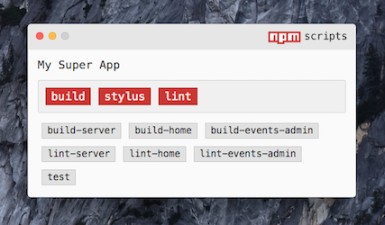

<br>  
<br>  
<p align="center">
 	
</p>
<br>  
<br>  

# npm scripts gui (NSG)
A ~~GUI~~ gooey interface for npm scripts.

<br>
<p align="center">
 	
</p>
<br>

*Tested on OS X Yosemite and El Capitan*

## Install
Install globally  
```
npm i -g npm-scripts-gui
```

## Instructions
##### Launching  
To launch Npm Script GUI (NSG), you must be in a directory with a `package.json` file.   

Then simply run:  
```
npm-script-gui
```   
or the shorter   
```
nsg
``` 

Any text output associated with the command will be printed to the command line where NSG was launched. 

##### Quiting  
To **quit** the app, it is safer to close the actual renderer window rather than quiting the process from the command line. If quiting from the command line, NSG may not do the check to make sure all processes are killed before closing. 

##### Stopping a Running Script  
Processes will die automatically when they finish or when the app is closed, but there may be times when you want to manually kill a process. Simply **double click the button**. 

## Configurations
NSG will automatically search for a `.nsgrc` in the same directory as the `package.json`. It should be in json format.

These are the available options:
- *name* (choose different name than defined in `package.json`)
- *primary* (the primary script buttons for scripts that will be ran more frequently)
- *exclude* (scripts to NOT include in the GUI)
- *alwaysOnTop* (whether the window is always in front of other windows)
- *font-stack* (the fonts in the GUI)

**.nsgrc Example**  
```
{
	"name": "Qualtrics to SFDC",
	"primary": ["build", "run-production", "run-sandbox"],
	"exclude": ["scripts-gui", "prebuild"],
	"alwaysOnTop": true,
	"font-stack": ["source code pro", "menlo", "helvetica neue"]
}
```

Any script not specified in `primary` or `exclude` will show up as a normal button. 

### Future Configuration Plans:  
- ability to sort scripts (e.g. alphabetically)
- different skins/themes (npm, node, light, dark, etc.)
- create custom commands not in package.json (specific to gui)
- run npm scripts in silent mode (good for linting tasks)
